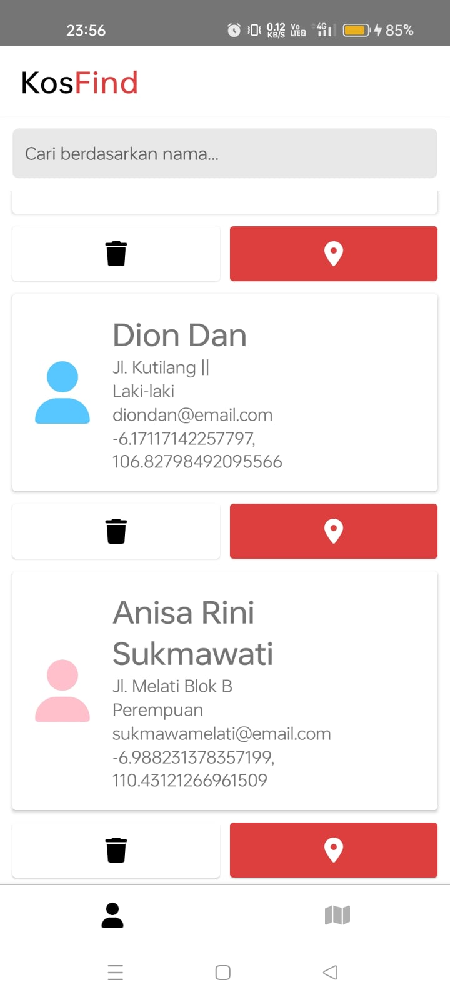
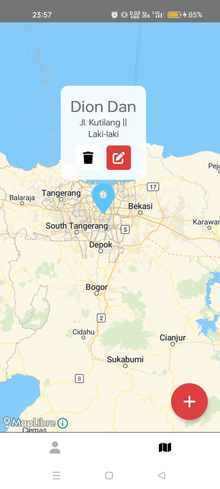
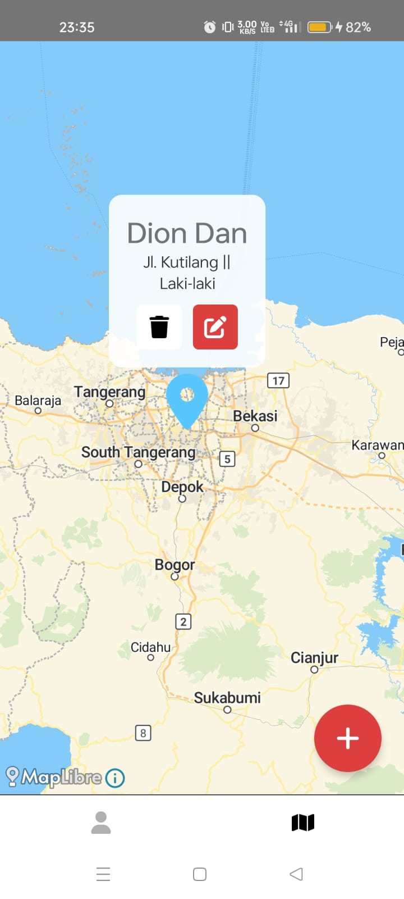
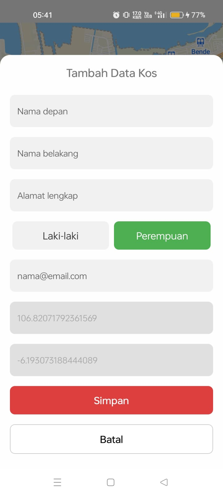
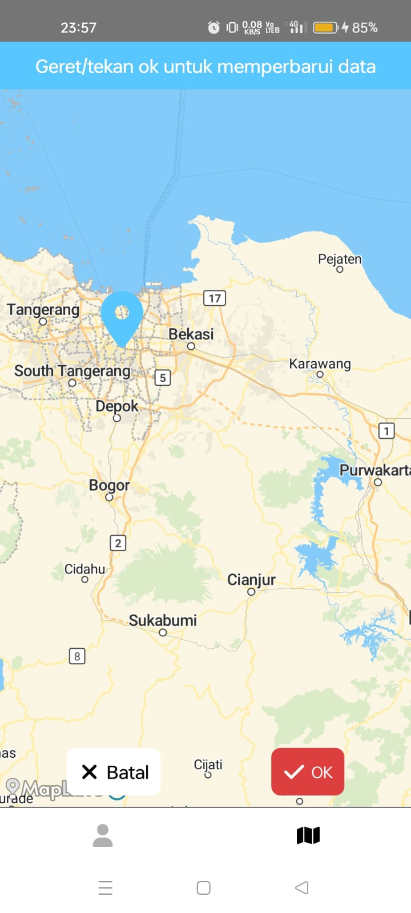
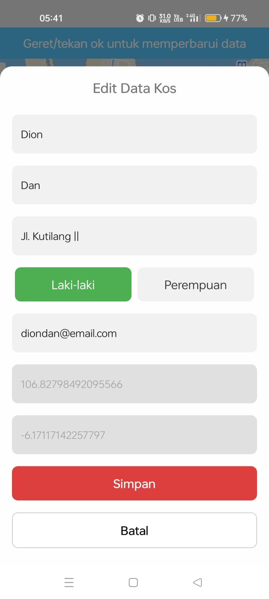
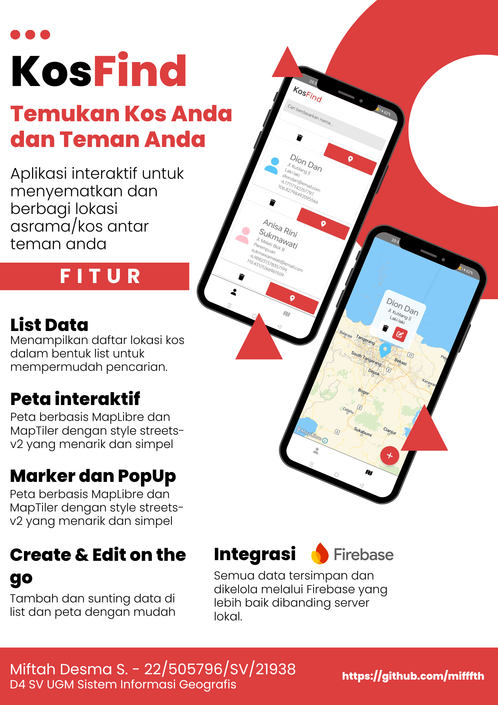

# KosFind
Portofolio aplikasi geospasial dan responsi PGPBL Semester 5
# KosFind  
Portofolio aplikasi geospasial dan responsi PGPBL Semester 5  

# 🌍 KosFind  

## 📄 Deskripsi Produk  
**KosFind** adalah aplikasi berbasis React Native yang memudahkan pengguna untuk menyematkan 📍 dan berbagi lokasi asrama/kos di peta interaktif.  
Aplikasi ini berguna untuk:  
- Melihat dan menynting daftar lokasi asrama/kos anda dan teman anda 🏘️  
- Menemukan asrama terdekat 🧭  
- Memantau penyebaran tempat tinggal di sekitar kampus 🎓  

## ⚙️ Komponen Pembangun Produk  
- **Framework:** React Native ⚛️  
- **Peta:** MapLibre & MapTiler 🗺️  
- **Database:** Firebase 🔥  

## 📊 Sumber Data  
- Data lokasi dikumpulkan secara mandiri oleh pengembang 🧑‍💻 dan partisipan aplikasi 👥.  

## 📷 Tangkapan Layar Komponen Penting Produk  

1. **Halaman List Data**  
   Menampilkan daftar lokasi asrama yang telah disematkan.  

   | 📋 List Data | 🗺️ Peta dengan Marker dan Pop-Up |
   |--------------|----------------------------------|
   |  |  |

2. **Mode Tambah Data dan Modal Add Data**  
   Halaman peta dengan fitur menambahkan marker baru, disertai modal untuk mengisi data.  

   | ➕ Tambah Data | ➕ Modal Tambah Data |
   |---------------|----------------------|
   |  |  |

3. **Mode Edit dan Modal Edit Data**  
   Halaman peta dengan fitur untuk mengedit marker yang sudah ada, disertai modal edit data.  

   | ✏️ Mode Edit | ✏️ Modal Edit Data |
   |--------------|---------------------|
   |  |  |  

## 🖼️ Poster Promosi  
Poster promosi aplikasi **KosFind**:  

  

